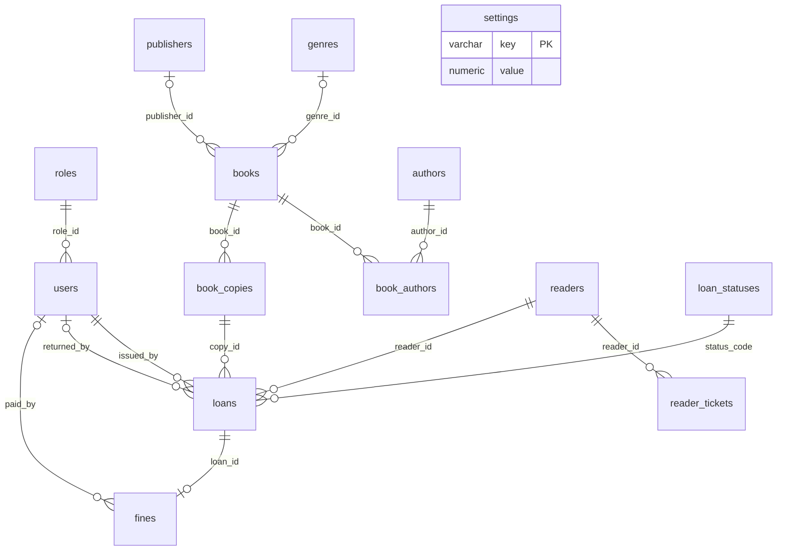

# База данных

Схема состоит из 14 таблиц. Первичные ключи сущностей — BIGINT IDENTITY.
book_authors использует составной ключ, settings — ключ настройки.
Связи защищены внешними ключами.

## Ограничения

- Уникальны логин, ISBN, инвентарный номер и номер читательского билета.
- У читателя может быть только один активный билет.
- У экземпляра может быть только одна незакрытая выдача.
- Выданная книга не имеет даты и сотрудника возврата; возвращённая имеет оба поля.
- Дата возврата не предшествует выдаче; билет не заканчивается раньше начала.
- Суммы штрафов положительны; дневная ставка неотрицательна.
- Штраф связан только с одной выдачей; повторное начисление для неё запрещено.
- Дата оплаты и сотрудник оплаты либо оба заполнены, либо оба отсутствуют.

Билет active может быть уже просрочен; сервис дополнительно проверяет диапазон дат.
Наличие книги на руках определяется выдачей, а не дополнительным флагом экземпляра.
condition отражает пригодность экземпляра: usable, repair, retired.
Книги архивируются, читатели и пользователи отключаются; история сохраняется.

## Настройки и расчёт

loan_days — целое число от 1 до 365; начальное значение 14.
daily_fine_rate — сумма от 0 до 10000 с точностью до копеек; начальное значение 10.
Ставка сохраняется в loans во время выдачи. Изменение настроек влияет на новые выдачи.
planned_return_date = issue_date + loan_days.
Штраф = число календарных дней после planned_return_date × сохранённая ставка.
Возврат в planned_return_date не считается просроченным.

## Подключение и права

Не используйте учётную запись суперпользователя PostgreSQL в приложении.
Для настройки схемы нужна учётная запись владельца БД.
Рабочей учётной записи достаточно USAGE на схему, SELECT/INSERT/UPDATE/DELETE
на прикладные таблицы, SELECT на roles и loan_statuses, USAGE/SELECT на последовательности.
Настройку прав выполняет владелец БД; имена учётных записей зависят от установки.
Доступ CREATE на схему рабочему приложению не требуется.

Для подключения к удалённому серверу используйте проверяемое TLS-соединение
и параметр sslmode=verify-full в JDBC URL с доверенным сертификатом.
Пароли БД задаются только в окружении процесса.

schema.sql выполняется один раз в пустой БД, reference-data.sql можно повторять.
Изменения схемы после начала эксплуатации следует оформлять отдельными SQL-файлами.
